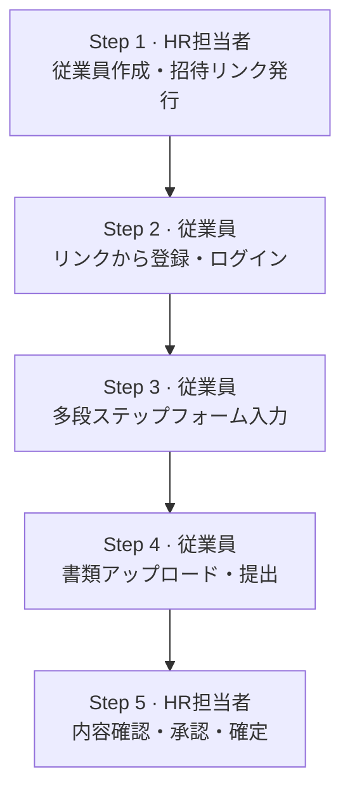

# RouMu Lite - 設計概要

> 労務系SaaSカスタマーサクセス職への転職を目指すポートフォリオプロジェクト
> 作成日: 2026-06-18 / バージョン: 0.1（Day 1）

---

## 1. プロジェクト概要

### 目的

SMARTHRをベンチマークに、入社手続き機能のミニ版を個人開発する。労務系SaaSのカスタマーサクセス職への転職時、技術ポートフォリオとして提出する。

### コアバリュー

「**労務ドメイン理解 × 技術理解**」の両軸を一つのプロダクトで証明する。エンジニア同等のコード力を示すことが目的ではなく、SMARTHRのようなプロダクトの仕組みと、その裏にある労務業務の痛みを両方の解像度で語れることを示す。

### 開発期間

1〜2ヶ月（短期決戦）

---

## 2. MVPスコープ

**入社手続き（オンボーディング）機能、一点突破。**

選定理由:

- SMARTHRが最初に世に出した中核機能で、面接で「なぜこの機能を選んだか」を語りやすい
- HR担当者と新入社員の2ロールが必要なので、認証・権限・ワークフローを自然に学べる
- 入社時に集める情報（住所、口座、扶養家族、マイナンバー、年金手帳、雇用契約書）が労務知識のショーケースになる
- 「招待 → 本人入力 → HR承認 → 確定」のワークフロー実装は、CSの説明力訓練として最適

---

## 3. ユーザーロールとフロー

### ロール

- **HR担当者（管理者）**: 従業員を招待し、提出内容を承認する
- **従業員（新入社員）**: 招待リンクから入って自分の情報を入力・提出する

### 5ステップフロー

---

## 4. 技術スタック

| カテゴリ | 採用技術 | 採用理由 |
|---|---|---|
| フロントエンド | Next.js (App Router) + TypeScript | モダンReactフレームワークのデファクト。労務SaaS求人で言及頻度が高い |
| スタイリング | Tailwind CSS | クラスベースの効率性、shadcn/uiとの相性 |
| UIコンポーネント | shadcn/ui | プロダクションレベルの見た目を短時間で実現 |
| バックエンド/DB | Supabase（Postgres + Auth + Storage） | 個人開発の現実解。バックエンドAPI実装を最小化 |
| 認証 | Supabase Auth（メール/パスワード + role） | 2ロール体制をシンプルに実現 |
| ホスティング | Vercel | GitHub連携で自動デプロイ、無料枠で十分 |

### 役割分担

Next.js (App Router) がHR画面と従業員画面の両方を持ち、URLで切り分ける。

- `/admin/*` ... HR用画面
- `/onboarding/*` ... 従業員用画面
- `/login` ... 共通ログイン

バックエンドAPIはほぼ書かない。Supabase SDKをフロントから直接叩き、データの守りはSupabase の **RLS (Row Level Security)** に任せる。

---

## 5. データモデル骨格

最小限のテーブル構成:

| テーブル | 役割 |
|---|---|
| `profiles` | auth.users と1対1、roleカラムで HR / 従業員 を区別 |
| `employees` | 従業員マスタ（氏名、入社日、雇用形態など） |
| `onboarding_submissions` | 提出単位、status: `draft` / `submitted` / `approved` / `rejected` |
| `employee_details` | 提出内容の本体（住所、口座、扶養家族など） |
| `uploaded_documents` | 書類ファイルのStorageへの参照 |

詳細設計は `02-data-model.md` で詰める。

---

## 6. 重要な設計判断

### 判断1: 招待リンクの送信方法

- **選択**: HR画面にURLを表示し、HRが手動で送る方式
- **代替案**: Supabase標準メール送信 / Resendなど外部メールサービス
- **理由**: 1〜2ヶ月の短期決戦のため、メール送信インフラよりも労務ドメインの作り込みに時間を使うべき。後から差し替えやすい設計にしておく

### 判断2: Supabaseセキュリティ設定

- **選択**:
  - Enable Data API: **オン**
  - Automatically expose new tables: **オフ**
  - Enable automatic RLS: **オン**
- **理由**: 労務情報は住所・口座・マイナンバーなど機微情報を含む。「明示的に許可したものだけアクセス可能」というデフォルト拒否のセキュリティポスチャを採用。新規テーブルは自動公開せず、RLSも自動有効化することで、ポリシー未定義のテーブルは誰からもアクセスできない状態を担保する

### 判断3: マルチテナント vs 単一テナント

- **選択**: 単一テナント（1社想定）
- **理由**: MVP段階ではマルチテナント化のコストが見合わない。RLSポリシーで「自分のデータだけ見える」設計にしておけば、後で `organization_id` を足してマルチテナント化することは可能

---

## 7. 8週間スケジュール

| Week | やること |
|---|---|
| 1 | Next.js / Supabase / Tailwind の素振り、Vercelデプロイで「Hello」を通す、Supabase認証チュートリアル完走 |
| 2 | データモデル確定、Supabaseでテーブル作成、RLSポリシー設定、`/login` と `/admin/dashboard` の骨組み |
| 3 | HR側「従業員作成 → 招待リンク発行 → 一覧表示」 |
| 4-5 | 従業員側 多段ステップフォーム（5〜6ステップ）+ 下書き保存 |
| 6 | 書類アップロード（Supabase Storage連携）+ 提出処理 |
| 7 | HR側 承認画面（提出内容表示、承認 / 差し戻し） |
| 8 | シードデータ、README整備、デモ動画、設計判断ドキュメント仕上げ |

---

## 8. Git/GitHub運用ルール

### リポジトリ

- 名前: `roumu-lite`
- 可視性: Public
- ライセンス: MIT

### ブランチ戦略

- `main` を本番ブランチ（Vercel自動デプロイ先）
- 機能ごとに `feature/employee-create` のようなブランチを切る
- ソロ開発でも必ずPR経由でマージする（PR履歴自体がポートフォリオになる）

### コミット規約

Conventional Commits を採用:

- `feat:` 新機能
- `fix:` バグ修正
- `docs:` ドキュメント変更
- `chore:` 設定変更など
- `refactor:` リファクタリング

### Issues / Project

- GitHub Issues でタスク管理
- ラベル: `feature` / `bug` / `chore` / `design`
- GitHub Projects（カンバン）で「Backlog / In progress / Done」管理

### CI

- Week 1〜2: Vercelの自動デプロイのみ
- Week 3以降: GitHub Actions で `npm run lint` と `npm run build` をPR時に実行

---

## 9. ポートフォリオとしての見せ方

### README に必ず入れる内容

- プロジェクト概要（なぜ作ったか、誰のための何か）
- スクリーンショット / デモGIF
- 技術スタックと採用理由
- 設計判断（本ドキュメントの内容を要約）
- ローカルでの動かし方
- デプロイURL

### docs/ フォルダ

設計判断・進捗・意思決定ログをMarkdownで残す。これ自体が「設計を文書化しながら進めた」という証拠になり、コードより評価される可能性もある。

予定するドキュメント:

- `00-profile.md` ... 開発者のスキル・経歴
- `01-design-overview.md` ... 本ドキュメント
- `02-data-model.md` ... ER図とテーブル定義
- `03-rls-policies.md` ... RLSポリシー設計
- `04-decisions-log.md` ... 意思決定ログ

---

## 10. 次のステップ

### Day 1（環境のお膳立て）

1. GitHubで `roumu-lite` リポを作成（Public、README・.gitignore (Node) 付き、MITライセンス）
2. Vercelアカウント作成（GitHub連携でログイン）
3. Supabaseアカウント作成して新規プロジェクト作成（リージョン: Tokyo、上記セキュリティ設定）

### Day 2-3（Next.js立ち上げ）

1. `npx create-next-app@latest roumu-lite --typescript --tailwind --app` を実行
2. mainブランチに初期コミット、GitHubへpush
3. VercelでGitHubリポを連携 → 初回デプロイが通ることを確認
4. 適当なトップページを書いて `feat:` でPR → セルフマージ（初回PRワークフロー経験）

### Day 4-7（Supabase素振り）

1. Supabase公式のNext.js認証チュートリアルを完走
2. ログイン・ログアウト・サインアップが一通り動くところまで
3. RLSの動作を体感する（テーブルを作って、ポリシーありなしでアクセス可否を比較）

### Week 2の頭

データモデル設計の会話を新しいチャットで開始。`employee_details` テーブルの項目を労務知識ベースで一緒に詰める。

---

## 変更履歴

| 日付 | バージョン | 変更内容 |
|---|---|---|
| 2026-06-18 | 0.1 | 初版作成（Day 1） |
